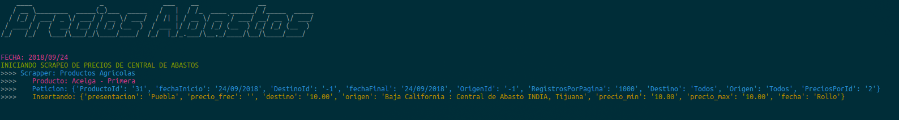

# Scraper Sistema Nacional de Información e Integración de Mercados

Scraper de precios de productos básicos basado en la pagina del SNIIM.

## Requerimientos
- [Python 3.5+] (https://www.python.org/)

## Datos
Fuente: [Sistema Nacional de Información e Integración de Mercados](http://www.economia-sniim.gob.mx/)

Secciones:
- Mercados Agricolas
    - Frutas y Hortalizas
    - Flores
    - Granos basicos
    - Azucar
    - Aceites comestibles
- Mercados Pecuarios
    - Bovinos: Empacadoras y distribuidoras
    - Aves: Pollo por partes (Empacadoras y distribuidoras)

## Esquema colecciones Mongo
Descripción de la estructura final de las colecciones para Mongo

### Agricultura
- Sección: Mercados Agricolas
- Mongo collection: *agricultura*
- Esquema: 
```sh
{
    "fecha": "mm/dd/yyyy", # String
    "presentacion": "string",
    "origen": "string",
    "destino": "string",
    "precio_min": "float",
    "precio_max": "float",
    "precio_frec": "float",
    "obs": "string"
}
```

### Ganado Aves: Pollo
- Sección: Mercados Pecuarios
- Mongo collection: *aves_partes_empacadores*
- Esquema: 
```sh
{
    "fecha": "mm/dd/yyyy", # String
    "pieza": "string",
    "precio_minimo_kg": "float",
    "precio_maximo_kg": "float",
    "frecuencia_kg": "float",
    "empacadora": "string"
}
```

### Ganado Bovino
- Mongo collection: *bovino_cortes_empacadoras*
- Esquema: 
```sh
{
    "fecha": "mm/dd/yyyy", # String
    "origen": "string",
    "corte": "string",
    "precio_minimo": "float",
    "precio_maximo": "float",
    "empacadora": "string"
}
```
## USO

## Instalación
Ejecutar este comando dentro de la carpeta principal para instalar correctamente el scraper.
```sh
python setup.py install
```
## Ejecución Local
Para utilizar el scraper en modo de ejecución local se debe correr el siguiente comando.
```sh
sniim --no-historial/--historial
```
Se debera visualizar algo similar a la siguiente imagen:



### Parametros
- **--historial**: Corre el scraper desde el 2000 hasta la fecha.
- **--no-historial:** Corre el scraper solo para el dia en que se ejecuta el comando.


### Semillas

Acceder a el folder Mercados_Nacionales_Agricolas
```sh
cd Mercados_Nacionales_Agricolas
```
Instalar dependencias
```sh
npm i 
```
Ejecutar programa
```sh
node scraper.js 2 12 2019
```